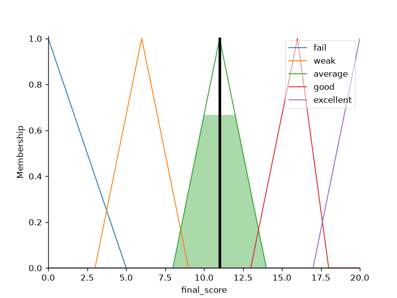
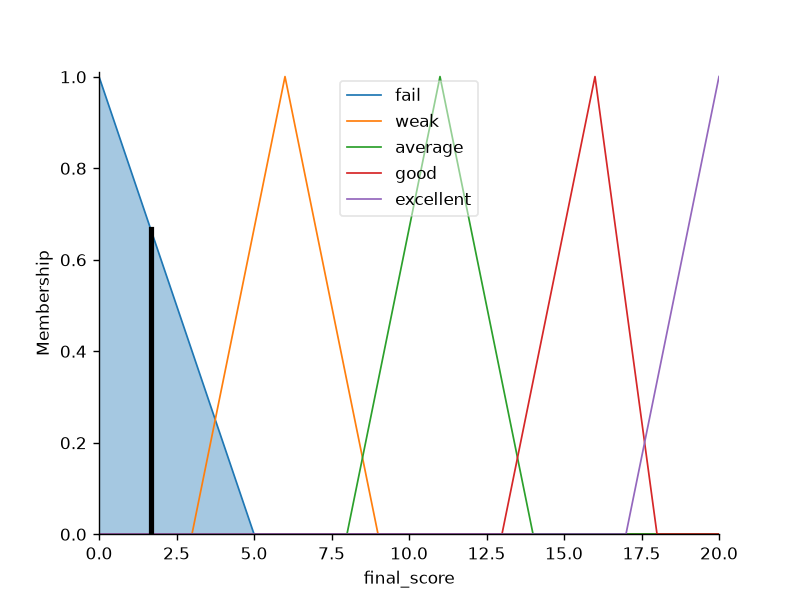
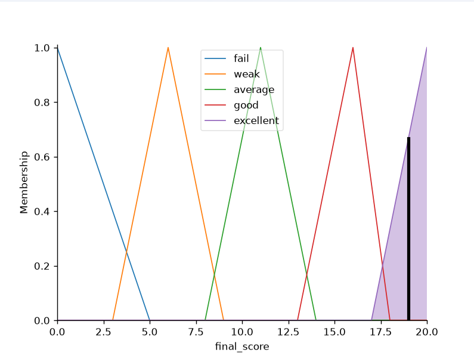

# Student Grading System Using Fuzzy Logic

## Overview

This project implements a fuzzy inference system to evaluate students' final grades based on presence, exam score, and homework using Python and scikit-fuzzy.

---

## Features

- 3 input variables
- 1 output variable
- 25 fuzzy rules
- Membership function visualization
- Automatic grading

---

## Technologies Used

- Python
- NumPy
- Matplotlib
- scikit-fuzzy

---

## Concepts Used

- Fuzzy Logic
- Membership Functions
- Rule-Based Inference
- Defuzzification

---

## How to Run
```bash
-python score_fuzzy_system.py
```
---
## Installation

```bash
pip install -r requirements.txt
```
---

## Project Structure

```text
score-fuzzy-system/
│
├── score_fuzzy_system.py
├── requirements.txt
├── README.md
└── images/
        ├── presence.png
        ├── exam.png
        ├── homework.png
        ├── final_score.png
        ├── student1_result.png
        ├── student2_result.png
        ├── student3_result.png
        └── student4_result.png

```

---

## Screenshots

### Membership Functions

#### Presence


#### Exam


#### Homework


#### Final Score


---

### Sample Results

#### Student 1

| Input | Value |
|-------|------:|
| Attendance | 85 |
| Exam Score | 17 |
| Homework | 90 |
| Final Score | **13.06** |


#### Student 2

| Input | Value |
|-------|------:|
| Attendance | 70 |
| Exam Score | 11 |
| Homework | 60 |
| Final Score | **10.99** |



#### Student 3

| Input | Value |
|-------|------:|
| Attendance | 0 |
| Exam Score | 0 |
| Homework | 0 |
| Final Score | **1.66** |



#### Student 4

| Input | Value |
|-------|------:|
| Attendance | 100 |
| Exam Score | 20 |
| Homework | 100 |
| Final Score | **19.0** |



---

## What I Learned
- Designing fuzzy membership functions
- Building a fuzzy rule base
- Using scikit-fuzzy
- Visualizing data with Matplotlib

## Future Improvements
- Read student data from CSV
- Export results to Excel

---
