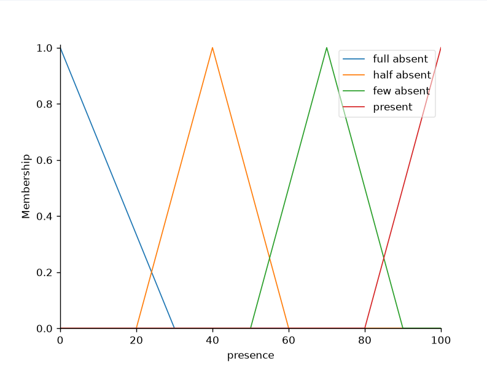
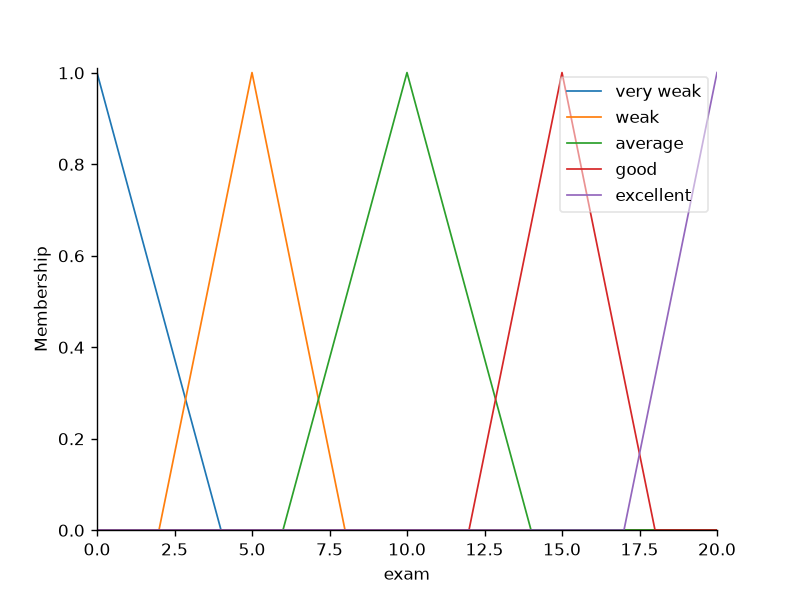
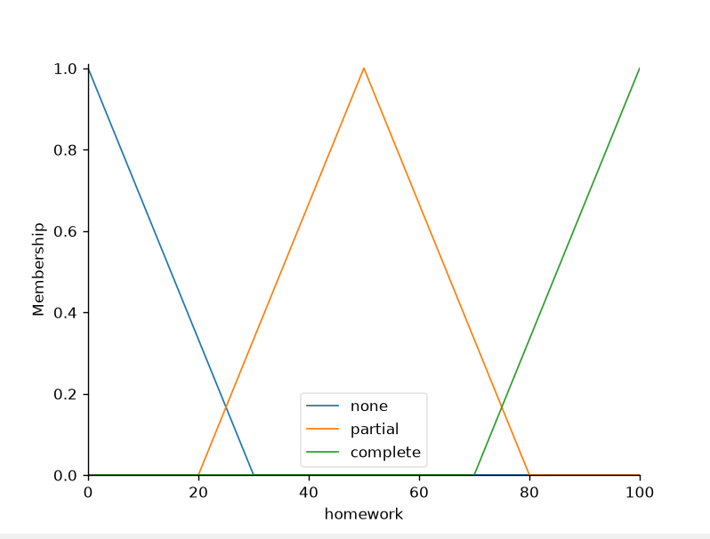
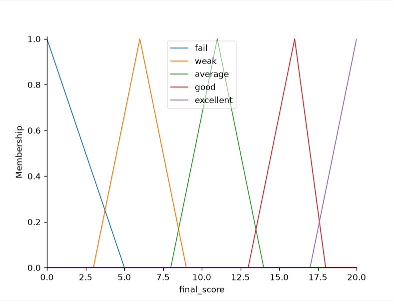
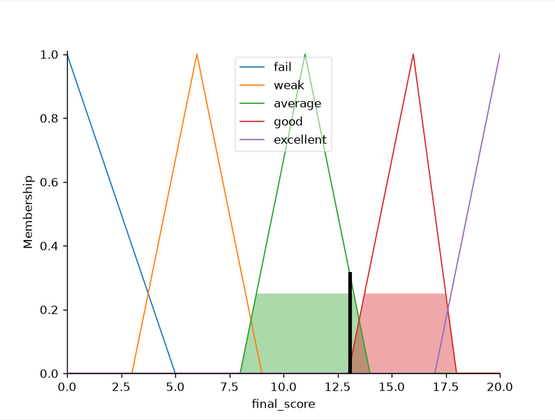

# Student Grading System Using Fuzzy Logic

## Overview

This project implements a fuzzy inference system to evaluate students' final grades based on attendance, exam score, and homework using Python and scikit-fuzzy.

---

## Features

- Three input variables
- One output variable
- 25 fuzzy rules
- Membership function visualization
- Automatic grading

---

## Technologies Used

- Python
- NumPy
- Matplotlib
- scikit-fuzzy

---

## Concepts Used

- Fuzzy Logic
- Membership Functions
- Rule-Based Inference
- Defuzzification

---

## How to Run
```bash
-python score_fuzzy_system.py
```
---
## Installation

```bash
pip install -r requirements.txt
```
---

## Project Structure

```text
score-fuzzy-system/
│
├── score_fuzzy_system.py
├── requirements.txt
├── README.md
└── images/
        ├── exam.png
        ├── presence.png
        ├── homework.png
        ├── final_score.png
        └── student1_result.png

```

---

## Screenshots

### Presence Membership Function



### Exam Membership Function



### Homework Membership Function



### Final Score Membership Function



### Sample Output



---

## What I Learned
- Designing fuzzy membership functions
- Building a fuzzy rule base
- Using scikit-fuzzy
- Visualizing data with Matplotlib

## Future Improvements
- Add GUI
- Read student data from CSV
- Export results to Excel

---
